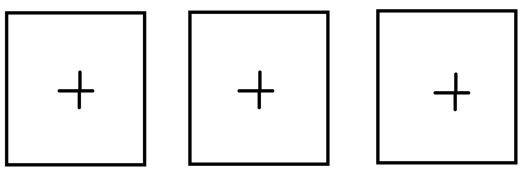

# Welcome to __Tradair__ 👋👋👋

Clone this repo to your local enviroment and install the dependencies of client and server folders.   
run 'npm start' in __client folder and in server folder__.  
In your browser you should see `<h1>Tradair Coding Assignment</h1>`.  
Open the console and you should get a stream representing prices of three pre-selected currency pairs.

## Step One - create placeholders for your widgets
   
- Create a functional component "Main" and render it below the h1 tag, pass _response_ as prop.
- Give each placeholder a uniqe id and center the placeholders in the middle of the screen, use **css flexbox**. 
- **Drag & Drop** - the user should have the abillity to change the order of the placeholders.  
- Add tooltips - "Add Widget" when hovering over the placeholders' plus sign.
- add style to your personal prefernce.

## Step Two - placeholder turning into widget
When the placeholder is clicked, the user gets to select a currency pair and amount.
The widget should show two dropdowns: currency pair and amount.
 - Amount can be: 1M, 2M, 3M, 4M, 5M
 - Create list of the three available currency pairs. When a pair is selected - remove it from the list.  
after selecting currency pair and amount the widget will display:    
 - CurrencyPairName above the widget
 - Prices (Bid & Offer) at the top of the widget (one next to the other)

## Step Three
Inside the Main component create a state to count how many times the user has clicked the Bid/Offer buttons.  
Use the following stracture:  
`{
usdIlsCouner: {bid: 0, offer: 0},    
eurUsdCounter: {bid: 0, offer: 0},  
usdJpyCounter: {bid: 0, offer: 0},  
}`  
From the Main component create a Child component.  
The Child component will only render the two buttons (Bid & Offer).  
Update the state of Main component from the child component when Bid/Offer buttons are clicked.  
Since nothing is expected to change inside child component, make sure the child component is going to be rendered only once.

## Step Four - NodeJS
Within the repository, under server/routes create a new route named "balance".  
The new route should expose an endpoint for the client to fetch from.  
 - The client should pass a parameter in request's body, the parameter's value should be `"bank1" or "bank2"`.  
 - The response from the server will be a dummy value representing the balance form the bank the user selected.  
 - Add two buttons: "get bank1 balance", "get bank2 balance".  
 - Get the response from the server and display the balance.
